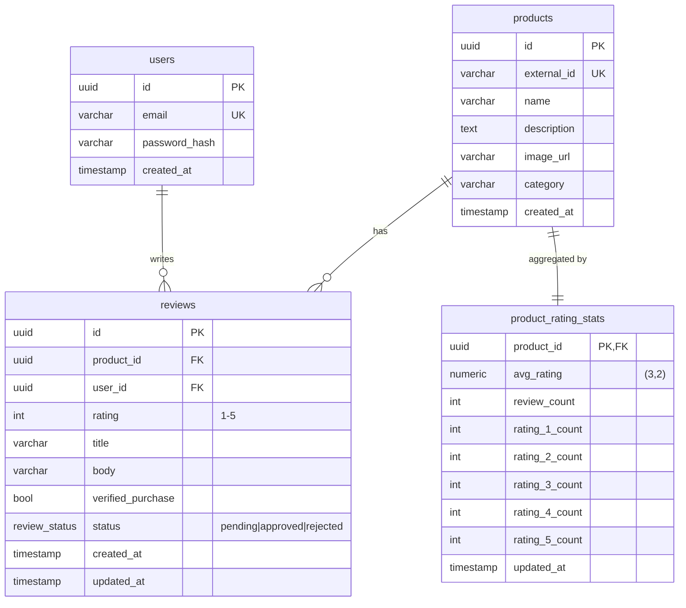

# Product Reviews System

A product-review service in the shape of Amazon or Alza: customers leave a 5-star review on a product, an admin moderates it, and only approved reviews are visible on the public product page and counted in its star rating. Built as a NestJS + Postgres API and a React SPA, connected through an OpenAPI-generated typed client.

## Setup

Prerequisites: **Node 22+**, **pnpm 10+**, and Docker (for Postgres).

```sh
# 1. Install dependencies
pnpm install

# 2. Start Postgres
docker run -d --name pg-reviews -p 5432:5432 \
  -e POSTGRES_PASSWORD=dev -e POSTGRES_DB=reviews postgres:16

# 3. Configure the API
cp apps/api/.env.example apps/api/.env

# 4. Apply schema and seed data (10 IT products + 3 customers)
pnpm --filter @reviews/api db:migrate
pnpm --filter @reviews/api db:seed

# 5. Run the API (port 3000)
pnpm dev:api
```

Seeded customer logins (all use password `password123`): `alice@example.com`, `bob@example.com`, `carol@example.com`.

The web app and admin curl examples will land in later PRs alongside the endpoints they exercise.

## Tech decisions

- **NestJS 11 on Fastify.** Picked Nest for the opinionated module/controller/service split.
- **Drizzle ORM + Postgres.** The product-rating aggregate is going to be one denormalized table recomputed inside the same transaction as every approve/reject. Drizzle gives me typed SQL without forcing me through an abstraction that hides the transaction boundary.
- **pnpm workspaces, three packages.** Small enough that Nx/Turbo would be overhead.

## Schema



`reviews` has `UNIQUE(product_id, user_id)` so a customer can leave at most one review per product. `product_rating_stats` is a denormalized projection of the *approved* subset of `reviews` — recomputed in the same transaction as every approve/reject.
