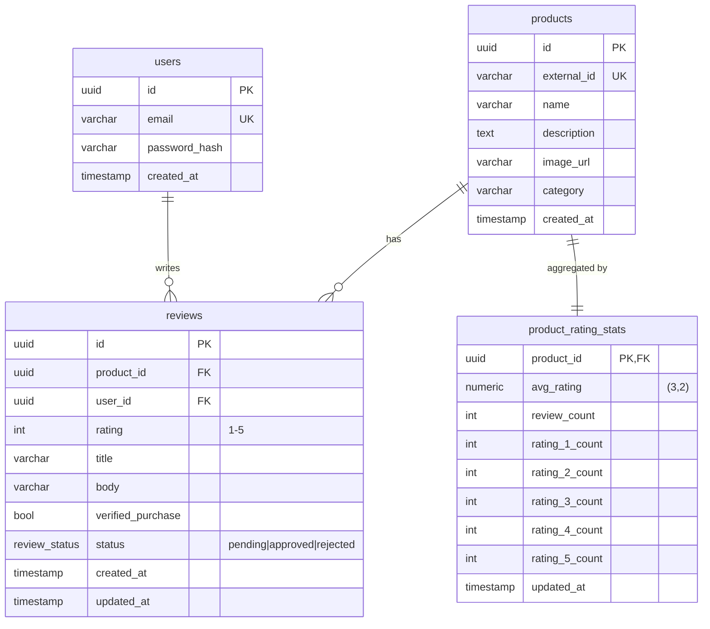

# Product Reviews System

A product-review service in the shape of Amazon or Alza: customers leave a 5-star review on a product, an admin moderates it, and only approved reviews are visible on the public product page and counted in its star rating. Built as a NestJS + Postgres API and a React SPA, connected through an OpenAPI-generated typed client.

## Setup

Prerequisites: **Node 22+**, **pnpm 10+**, and Docker (for Postgres).

```sh
# 1. Install dependencies
pnpm install

# 2. Start Postgres
docker run -d --name pg-reviews -p 5432:5432 \
  -e POSTGRES_PASSWORD=dev -e POSTGRES_DB=reviews postgres:16

# 3. Configure the API
cp apps/api/.env.example apps/api/.env

# 4. Apply schema and seed data (10 IT products + 3 customers)
pnpm --filter @reviews/api db:migrate
pnpm --filter @reviews/api db:seed

# 5. Run the API (port 3000)
pnpm dev:api
```

Seeded customer logins (all use password `password123`): `alice@example.com`, `bob@example.com`, `carol@example.com`.

The API serves an OpenAPI 3 spec at [`/openapi.json`](http://localhost:3000/openapi.json) and an interactive Swagger UI at [`/docs`](http://localhost:3000/docs).

## Run the web app

The web is a Vite + React 19 SPA at `apps/web`, served on port 5173. It calls the API at `http://localhost:3000` by default (override with `VITE_API_BASE_URL` in `apps/web/.env`).

```sh
pnpm dev:web
```

Open [`http://localhost:5173`](http://localhost:5173). Browsing the catalog and product pages does not require auth. Clicking **Log in** in the header (or **Log in to write a review** on a product page) opens the login dialog — use one of the seeded customer accounts above. A submitted review is `pending` until an admin moderates it; in the meantime the author sees it on the product page in a separate "Your review" slot, with a status badge.

To approve a pending review:

```sh
# Set ADMIN_TOKEN to whatever apps/api/.env defines
curl -X POST -H "Authorization: Bearer $ADMIN_TOKEN" \
  http://localhost:3000/admin/reviews/<review-id>/approve
```

## Tech decisions

- **NestJS 11 on Fastify.** Picked Nest for the opinionated module/controller/service split.
- **Drizzle ORM + Postgres.** The product-rating aggregate is going to be one denormalized table recomputed inside the same transaction as every approve/reject. Drizzle gives me typed SQL without forcing me through an abstraction that hides the transaction boundary.
- **pnpm workspaces, three packages.** Small enough that Nx/Turbo would be overhead.
- **React Router v7 in data mode.** Loaders/actions handle reads and mutations; no client-state library. Post-action loader revalidation keeps the header and product detail in sync with the auth state and pending-review slot.
- **Tailwind v4 + shadcn/ui.** shadcn vendors component source under `apps/web/src/components/ui/` instead of installing a UI library, so the workspace stays at three packages.
- **JWT in `localStorage`.** *The issue:* anything in `localStorage` is readable by any script on the origin, so a single XSS — stored, reflected, or via a compromised npm dep — exfiltrates the token and gives the attacker the user's full session for the token's lifetime. *The real-app approach for a first-party SPA + API like this one* (per the IETF BCP *OAuth 2.0 for Browser-Based Applications*, which puts this architecture out of OAuth scope) *is server-side sessions:* the API issues an opaque session ID in an `httpOnly + Secure + SameSite=Lax` cookie and looks it up against a `sessions` table on each request. Revocation is a `DELETE`; there's no JWT, no refresh-token rotation, no race conditions across tabs. The OAuth-flavored alternative (short JWT in memory + refresh-token cookie + rotation) makes sense when the API has multiple client types or stateless verification at the edge — neither applies here. *What ships:* localStorage, with the XSS tradeoff documented; React's default escaping plus a small dep surface bound the blast radius. The honest hardening order is (1) a strict CSP header, (2) the session-cookie migration — in that order.

## Typed API client

`packages/api-client` is a thin workspace package the web app consumes for typed access to the API. Types are generated from the API's OpenAPI spec; the runtime is a ~30-line wrapper around [`openapi-fetch`](https://openapi-ts.dev/openapi-fetch).

```ts
import { createCustomerClient } from '@reviews/api-client';

const client = createCustomerClient({
  baseUrl: 'http://localhost:3000',
  getToken: () => localStorage.getItem('jwt'),
});

const { data, error } = await client.GET('/products');
```

The generated `openapi.json` and `src/generated/openapi.d.ts` are committed. After changing any API DTO or controller, regenerate them:

```sh
pnpm --filter @reviews/api-client codegen
```

CI re-runs codegen on every PR and fails when the committed artifacts drift from the API source.

## Schema



`reviews` has `UNIQUE(product_id, user_id)` so a customer can leave at most one review per product. `product_rating_stats` is a denormalized projection of the *approved* subset of `reviews` — recomputed in the same transaction as every approve/reject.
